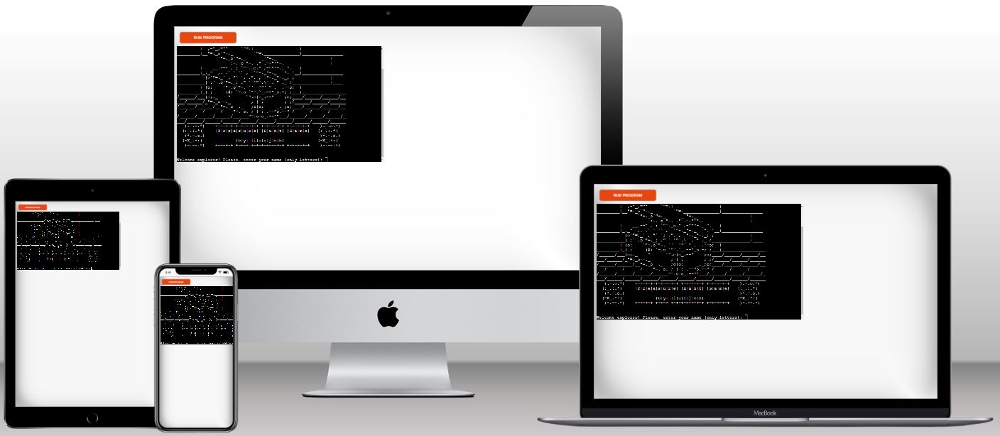

# Treasure Hunt game

Play the game [here](https://iurjoh-treasure-hunt.herokuapp.com/)

This game is designed to test Python basic skills acquired in the Code Institute's Full Stack developer course. This game is similar to a classic Battlefield game, built in to be played by a user trying to find treasure a map through the use of row and column instructions.

# How to play

The user is greeted with some basic information about the game such as board size, amount of treasure on the map and attempts to find it. Then you are asked to enter a name.

Then some other information is placed and lines of text for immersion in the game context are presented. A map with dimensions of 5x5 is shown on the screen then the game starts.

Each round the user must enter a new coordinate with number to a row and a column subsequently.

If the coordinates is outside the map dimensions or has already been chosen in a previous turn, the user will not lose any attempt but must enter new valid coordinates.

If he chooses a location where the treasure is not, he will have a reduced chance of his total attempts by a maximum of 10, until he has no more chance and loses the game.

If you find the treasure before the attempts are over, you will receive a victory message.

# Features
## Existing Features
### Title and basic information

A title with a clean design to introduce users to the game.

### Introduction

A small introduction to contextualize the player in the game environment. In this field the user must choose a nickname and then receive lines of text to give more immersion.

### Board

In this area the game itself develops. A grid composed of 25 cells arranged in a 5x5 matrix where only a certain coordinate contains the treasure.

With each new game, this treasure is placed at random for the user to try to find it, so the replay factor makes the game more inviting.

### Turns

All the player's possibilities are shown on the map and each turn the user must choose a number between 0 and 4 for both the row and the column.

The chosen coordinates will be are marked on the map with an X. In these places there were no treasures, so they should not be re-chosen. A new turn will start again asking the player what the new coordinates will be and the player will have one less try to find the treasure.

If the location has the treasure hidden in it, then the user has discovered it and won the game.

### Input validation and error-checking

If the coordinates are off the map, that is, with numbers that are not between 0 and 4 for both rows and columns, an error message will be displayed on the screen but no attempt will be lost by the user, which will keep their chances. same as the previous turn.

If the coordinates are equal to some that had been previously chosen by the user, an error message will be displayed on the screen and, in the same way as the previous one, no penalty will occur in relation to the user's attempts.

### End Game Rules

The game will end when the user has used up all their attempts and has not found the treasure.

Or when within his 10 chances he manages to find the exact location of the treasure.

## Features to Increment
- Add a vs. CPU mode to play against the computer.
- Add more competitiveness to the game with an accumulative score display that will be updated at each end of the match.
- Add a mode with a countdown timer for each player's move, where if the time runs out, the player will lose his turn or have his move made by the computer.
- Add a stopwatch to show the elapsed time in each match.
- Add a game mode that saves wins in record time.

# Tests
## Syntax test
Python syntax checker from Extends Class and Python style guide checker from pycodestyle 2.9.1 were used to test, verify and validate code written in python.

No errors were returned from both.

## Defensive testing data inputs
Here are the tests that we have conducted to ensure that the program is working correctly:

### Test 1: Valid Input
Description: Enter a valid name and a valid level choice.

Steps:

When prompted, enter a name that contains only alphabets and is at least one character long.
When prompted, enter a valid level choice (1-3).
Expected Result: The program should start the game with the given name and level.

### Test 2: Invalid Name
Description: Enter an invalid name.

Steps:

When prompted, enter a name that contains non-alphabetic characters or is empty.
Expected Result: The program should display an error message and prompt the user to enter a valid name.

### Test 3: Invalid Level Choice
Description: Enter an invalid level choice.

Steps:

When prompted, enter a level choice that is not between 1-3.
Expected Result: The program should display an error message and prompt the user to enter a valid level choice.

### Test 4: Restart Game
Description: Restart the game without entering the name again.

Steps:

Start the game with a valid name and level choice.
When prompted to restart the game, enter 'Y' to restart the game.
When prompted, enter a valid level choice (1-3).
Expected Result: The program should restart the game with the same name and the new level choice.

### Test 5: Invalid Restart Choice
Description: Enter an invalid restart choice.

Steps:

Start the game with a valid name and level choice.
When prompted to restart the game, enter an invalid choice that is not 'Y' or 'N'.
Expected Result: The program should display an error message and prompt the user to enter a valid restart choice.

### Test 6: Winning the Game
Description: Win the game by finding the treasure.

Steps:

Start the game with a valid name and level choice.
Keep playing the game until the treasure is found.
Expected Result: The program should display a winning message and prompt the user to play again or quit.

### Test 7: Losing the Game
Description: Lose the game by running out of moves.

Steps:

Start the game with a valid name and level choice.
Keep playing the game until all moves are used up.
Expected Result: The program should display a losing message and prompt the user to play again or quit.

# Languages Used
- [Python](https://en.wikipedia.org/wiki/Python_(programming_language))

# Deployment
This game was deployed using Code Institute's mock terminal for Heroku.
- First fork or clone this repository
- Create a new Heroku app
- Set the buildbacks to Python and NodeJS in that order
- Link the Heroku app to the GitHub repository
- Click on deploy 

The link to the deployed game at Heroku is: https://git.heroku.com/iurjoh-treasure-hunt.git

The full file was also deployed in my GitHub repository. The steps are as follows:
- In the GitHub repository, click on Settings tab;
- Navigate to the menu on the left side and select Pages;
- Set the source in the Build and deployment item as "Deploy from a branch". Then, in the Branch item, the Main option was chosen, /(root) folder and finishing the settings with the Save button.

The link to the deployed website at GitHub is: https://iurjoh.github.io/Treasure-Hunt/

# Credits
Here will be the sites that helped me find everything I needed to develop my work, including research and material sources.

## Content

Sites such as:
- [Stack Overflow](https://stackoverflow.co/) were used at various times to clear up recurring doubts,
- [Code Institute](https://learn.codeinstitute.net/) to review material of study explanatory videos and guides on how to set up a complete website;
- [GitHub](https://github.com/) to better understand other projects;
- [Google](https://www.google.com) for more information on subjects related to the that I had to study during the creation of the site;
- [Wikipedia](https://en.wikipedia.org/wiki/Main_Page) to understand concepts about Python;
- [Youtube](https://www.youtube.com/) tutorials to learn using in a practical way some of the methods necessary to implement the desired functions for the game;
- [Pycodestyle](https://pypi.org/project/pycodestyle/) used to validade my python code;
- [Extends Class](https://extendsclass.com/python-tester.html) used to test my python code syntax;
- [Slack](https://slack.com/) communities to ask questions and access answers to questions that I found in the development of the site.

## Media

- [Techsini](https://techsini.com/multi-mockup/index.php) Multi Device Website Mockup Generator was used to generate the image used in this README.md in the opening section.

## Acknowledgements
- My mentor for continuous helpful feedback.