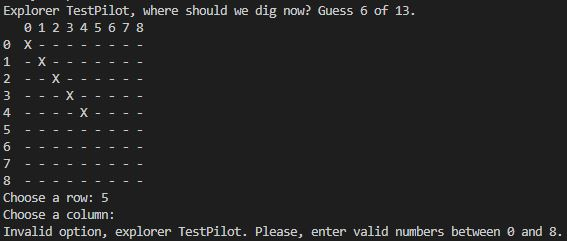

# Treasure Hunt game

Play the game [here](https://iurjoh-treasure-hunt.herokuapp.com/).

This game is designed to test Python basic skills acquired in the Code Institute's Full Stack developer course. This game is similar to a classic Battlefield game, built in to be played by a user trying to find one treasure in a map through the use of row and column instructions.

# How to play

The user is greeted with a treasure chest image in ASCII graphic style, and the player are asked to enter a name.

After input a valid name (only letters from A-Z) a menu with three different map dimensions are presented, each one for a respective game level is displayed.

After chosen a size, the player is then invited to choose a location to begin their exploration. Depending on the level the player chose a 3x3, 5x5 or 9x9 map will be presented and then the player will be invited to choose a number between 0 and the maximum coordinate on the right of the map (2, 4 or 8).

Each round the user must enter a new coordinate with number to a row and a column subsequently.

If the coordinates are outside the map dimensions or has already been chosen in a previous turn, the user will not lose any attempt but must enter new valid coordinates.

If chooses a location where the treasure is not, will have a reduced chance of his total attempts by one, until has no more chance and loses the game.

If the player does not find the treasure before the attempts are over, will receive citation and an end game message, followed for a question for play again or quit.

If the player finds the treasure before the attempts are over, will receive citation and victory message, followed for a question for play again or quit.

# Features
## Existing Features
### Title and basic information

A title screen with a graphic design to introduce users to the game.

### Welcome and Name Input

A short welcome greeting is presented. Then the player is invited to enter a valid name.

### Game level

The player must choose between 3 predetermined levels of difficulty. Being:
1. Easy (Board size: 3x3)
2. Medium (Board size: 5x5)
3. Hard (Board size: 9x9)

Here, only numbers 1, 2 and 3 are accepted as inputs.

### Board

In this area the game itself develops. A grid composed of a matrix cell where only a certain coordinate contains the treasure.

With each new game, this treasure is placed at random for the user to try to find it, so the replay factor makes the game more inviting.

### Turns

All the player's possibilities are shown on the map and each turn the user must choose a number between 0 and the right border (maximum size of the matrix -1) for both the row and the column.

The chosen coordinates will be are marked on the map with an X. In these places there were no treasures, so they should not be re-chosen. A new turn will again start asking the player what the new coordinates will be and the player will have one less try to find the treasure.

If the location has the treasure hidden in it, then the user has discovered it and won the game.

### Input validation and error-checking

If the coordinates are off the map, that is, with numbers that are not between 0 and maximum range of the chosen level, for both rows and columns, an error message will be displayed on the screen but no attempt will be lost by the user, which will keep their chances. Same as the previous turn.

If the coordinates are equal to some that had been previously chosen by the user, an error message will be displayed on the screen and, in the same way as the previous one, no penalty will occur in relation to the user's attempts.

If the player enters any value that is not valid, this being an empty space, non-integer numbers, negatives, fractions, letters, signs or special characters, an error will be displayed, the player will be invited to choose his coordinates again, this time using only numbers valid for chosen game level(size), without losing a previous attempt.

### End Game Rules

#### Treasure Not Found

After spending all available attempts, the player did not find the treasure and so the game comes to an end with the player's defeat.

Note that all the player's attempts have been recorded on the board with "X", while the location of the treasure is shown with the letter "T". This location is also written in the game.

#### Treasure Found

When within his chances the player manages to find the exact location of the treasure a win message will be displeyd, and the location of the treasure is also displayed with the letter "T" on the board.

## Restart

When the game comes to an end, in both winning and losing situations, the player will be able to choose whether to continue playing.

If you accept, you will choose the desired difficulty for your new game again and then the loop of a new game starts keeping the player's name, however, the treasure will have its location randomized again.

If the player does not want to continue playing at the end of a game, he will find a thank you message for having played and will be invited to come back soon.

## Features to Increment
- Add a vs. CPU mode to play against the computer.
- Add more competitiveness to the game with an accumulative score display that will be updated at each end of the match.
- Add a mode with a countdown timer for each player's move, where if the time runs out, the player will lose his turn or have his move made by the computer.
- Add a stopwatch to show the elapsed time in each match.
- Add a game mode that saves wins in record time.

# Tests
## Syntax test
Python syntax checker from Extends Class and Python style guide checker from flake8 and pycodestyle 2.9.1 were used to test, verify and validate code written in python.

No major errors were returned from both, except "E501 line too long" caused for some text phrases inside the game, and "W605 invalid escape sequence", "W291 trailing whitespace", "W293 blank line contains whitespace" caused by game graphics using ASCII art style.

Code Institute PEP8 Checker - ["CI Python Linter"](https://pep8ci.herokuapp.com/) also used and return the same errors.

## Defensive testing data inputs
Here are the tests that we have conducted to ensure that the program is working correctly:

### Test 1: Valid Input
Description: Enter a valid name and a valid level choice.

Steps:

When prompted, enter a non-empty name that contains letters from A to Z and is at least one character long.
When prompted, enter a valid level choice (1-3).

Expected Result: The program should start the game with the given name and level.

### Test 2: Invalid Name
Description: Enter an invalid name.

Steps:

When prompted, enter a name that contains non-alphabetic characters or is empty.

Expected Result: The program should display an error message and prompt the user to enter a valid name.

### Test 3: Invalid Level Choice
Description: Enter an invalid level choice.

Steps:

When prompted, enter a level choice that is not between 1-3.

Expected Result: The program should display an error message and prompt the user to enter a valid level choice.

### Test 4: Restart Game
Description: Restart the game without entering the name again.

Steps:

Start the game with a valid name and level choice.
When prompted to restart the game, enter 'Y' to restart the game.
When prompted, enter a valid level choice (1-3).

Expected Result: The program should restart the game with the same name and the new level choice.

### Test 5: Invalid Restart Choice
Description: Enter an invalid restart choice.

Steps:

Start the game with a valid name and level choice.
When prompted to restart the game, enter an invalid choice that is not 'Y' or 'N'.

Expected Result: The program should display an error message and prompt the user to enter a valid restart choice.

### Test 6: Winning the Game
Description: Win the game by finding the treasure.

Steps:

Start the game with a valid name and level choice.
Keep playing the game until the treasure is found.

Expected Result: The program should display a winning message and prompt the user to play again or quit.

### Test 7: Losing the Game
Description: Lose the game by running out of moves.

Steps:

Start the game with a valid name and level choice.
Keep playing the game until all moves are used up.

Expected Result: The program should display a losing message and prompt the user to play again or quit.

# Languages Used
- [Python](https://en.wikipedia.org/wiki/Python_(programming_language))

# Deployment
This game was deployed using Code Institute's mock terminal for Heroku.
- First fork or clone this repository.
- Create a new Heroku app.
- Set the buildbacks to Python and NodeJS in that order.
- Link the Heroku app to the GitHub repository.
- Click on deploy.

The link to the deployed game at Heroku is: https://git.heroku.com/iurjoh-treasure-hunt.git

The full file was also deployed in my GitHub repository. The steps are as follows:
- In the GitHub repository, click on Settings tab;
- Navigate to the menu on the left side and select Pages;
- Set the source in the Build and deployment item as "Deploy from a branch." Then, in the Branch item, the Main option was chosen, /(root) folder and finishing the settings with the Save button.

The link to the deployed website at GitHub is: https://iurjoh.github.io/Treasure-Hunt/

# Credits
Here will be the sites that helped me find everything I needed to develop my work, including research and material sources.

## Content

Sites such as:
- [Stack Overflow](https://stackoverflow.co/) were used at various times to clear up recurring doubts,
- [Code Institute](https://learn.codeinstitute.net/) to review material of study explanatory videos and guides on how to set up a complete website;
- [GitHub](https://github.com/) to better understand other projects;
- [Google](https://www.google.com) for more information on subjects related to the that, I had to study during the creation of the site;
- [Wikipedia](https://en.wikipedia.org/wiki/Main_Page) to understand concepts about Python;
- [Youtube](https://www.youtube.com/) tutorials to learn using in a practical way some of the methods necessary to implement the desired functions for the game;
- [Pycodestyle](https://pypi.org/project/pycodestyle/) used to validade my python code;
- [Extends Class](https://extendsclass.com/python-tester.html) used to test my python code syntax;
- [Slack](https://slack.com/) communities to ask questions and access answers to questions that I found in the development of the site;
- [ASCII](https://ascii.co.uk/) where I found all the necessary material for the graphic arts present in the game and the base to create modified projects by myself.

## Media

- [Techsini](https://techsini.com/multi-mockup/index.php) Multi Device Website Mockup Generator was used to generate the image used in this README.md in the opening section.

## Acknowledgements
- My mentor for continuous helpful feedback.